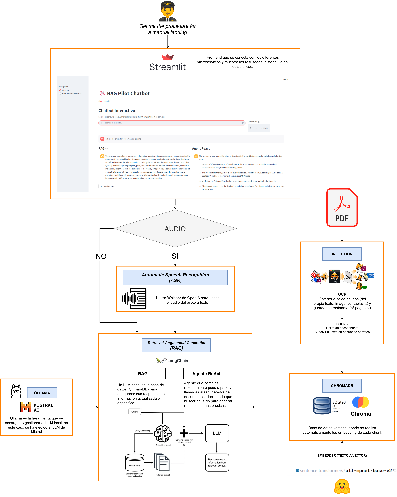

[](LICENSE)


# 🛩️ Agente RAG para Asistir al Piloto por Comandos de Voz - TFM

Este proyecto consiste en la creación de un asistente para el piloto, que permite la comunicación por voz y por escrito. El sistema abarca desde el reconocimiento de voz (Speech to Text) hasta el agente RAG, encargado de entender la consulta y generar la respuesta utilizando la base de datos proporcionada.


---

## ⭐ Consideraciones principales

- **🖥️ Ejecución local:** Todo el sistema funciona completamente offline, sin conexión a internet, garantizando la seguridad y la integración en sistemas aeronáuticos.
- **🧩 Arquitectura de microservicios:** Cada microservicio realiza una acción específica.
- **💻 Desarrollo:** El proyecto se ha desarrollado en Visual Studio Code sobre Ubuntu WSL.

---

## ⚙️ Instalación inicial

Antes de comenzar, asegúrate de tener instalado lo siguiente:

1. **📝 Visual Studio Code**  
   Descárgalo desde [Visual Studio Code](https://code.visualstudio.com/download)

2. **🐧 Ubuntu WSL** (si trabajas desde Windows)  
   - [Guía de instalación de WSL](https://learn.microsoft.com/es-es/windows/wsl/install)

3. **🔗 Git**
   - Instalación:
     ```bash
     sudo apt install git
     ```
   - Configura tu usuario de Git:
     ```bash
     git config --global user.name "Tu Nombre"
     git config --global user.email "tu@email.com"
     ```
   - (Recomendado) Configura autenticación SSH para mayor seguridad:
     ```bash
     ssh-keygen -t ed25519 -C "tu@email.com"
     ```
     Durante la generación de la clave, puedes establecer una **passphrase** (contraseña) para proteger tu clave privada SSH.  
     Si la estableces, cada vez que uses la clave se te pedirá la contraseña.
     ```bash
     eval "$(ssh-agent -s)"
     ssh-add ~/.ssh/id_ed25519
     cat ~/.ssh/id_ed25519.pub
     ```
     Copia la clave pública y añádela a tu cuenta de GitHub en [SSH keys](https://github.com/settings/keys).

4. **🐍 Python 3.x y entorno virtual (obligatorio)**

   - **En Linux/WSL:**  
     Instala Python y pip:
     ```bash
     sudo apt update && sudo apt install python3 python3-pip python3.10-venv
     ```
     Crea y activa un entorno virtual:
     ```bash
     python3 -m venv venv
     source venv/bin/activate
     ```
     Para desactivar el entorno virtual:
     ```bash
     deactivate
     ```

   - **En Windows:**  
     Descarga e instala Python desde [python.org](https://www.python.org/downloads/).  
     Luego, en CMD:
     ```cmd
     python -m venv venv
     venv\Scripts\activate
     ```
     En PowerShell:
     ```powershell
     python -m venv venv
     .\venv\Scripts\Activate.ps1
     ```
     Para desactivar el entorno virtual (CMD o PowerShell):
     ```cmd
     deactivate
     ```

   > **ℹ️ Nota:** Recuerda activar el entorno virtual cada vez que vayas a trabajar en el proyecto y desactivarlo con `deactivate` cuando hayas terminado.
5. **Carga automática de LLM por microservicio Ollama**

    El modelo LLM (por ejemplo, Mistral-7B-Instruct) se descarga automáticamente por el microservicio de Ollama al arrancar, según la configuración indicada en el archivo `config.yaml` correspondiente. No es necesario descargar el modelo manualmente ni gestionar tokens de HuggingFace en la mayoría de los casos.

    > **Nota:** El microservicio Ollama gestiona la descarga y actualización del modelo de forma automática. Solo asegúrate de que el archivo de configuración (`config.yaml`) especifica el modelo deseado y que el contenedor tiene acceso a internet la primera vez que se arranca para descargar el modelo (después se podrá utilizar sin internet).

    > **Nota adicional:** Si el modelo LLM que deseas utilizar requiere permisos especiales de HuggingFace (por ejemplo, Mistral-7B-Instruct), es posible que debas:
    > - Crear una cuenta en HuggingFace en https://huggingface.co/join
    > - Solicitar acceso al modelo desde la página correspondiente (ejemplo: Mistral-7B-Instruct-v0.3)
    > - Obtener tu token personal en https://huggingface.co/settings/tokens
    > - Autenticarte en tu terminal ejecutando:
    >   ```bash
    >   huggingface-cli login
    >   ```
    >   e introducir tu token cuando lo solicite.
    > Estos pasos solo son necesarios si Ollama o el microservicio lo solicita explícitamente al descargar el modelo.
6. **Soporte GPU para Ollama y microservicios IA**
    Para usar Ollama (y otros microservicios de IA) con aceleración GPU, debes instalar el NVIDIA Container Toolkit en tu sistema host. Los pasos de instalación y configuración de Docker para GPU son los siguientes:

    #### Instalar NVIDIA Container Toolkit (Debian/Ubuntu)

      **Configura el repositorio:**
      ```bash
      curl -fsSL https://nvidia.github.io/libnvidia-container/gpgkey \
        | sudo gpg --dearmor -o /usr/share/keyrings/nvidia-container-toolkit-keyring.gpg
      curl -s -L https://nvidia.github.io/libnvidia-container/stable/deb/nvidia-container-toolkit.list \
        | sed 's#deb https://#deb [signed-by=/usr/share/keyrings/nvidia-container-toolkit-keyring.gpg] https://#g' \
        | sudo tee /etc/apt/sources.list.d/nvidia-container-toolkit.list
      sudo apt-get update
      ```

      **Instala el toolkit:**
      ```bash
      sudo apt-get install -y nvidia-container-toolkit
      ```

      **Configura Docker para usar el driver Nvidia:**
      ```bash
      sudo nvidia-ctk runtime configure --runtime=docker
      sudo systemctl restart docker
      ```

      > **Nota:** El arranque de Ollama y el resto de microservicios se realiza mediante docker-compose, que ya incluye la configuración para usar GPU si está disponible. No es necesario arrancar manualmente los contenedores ni ejecutar modelos manualmente, salvo para pruebas avanzadas.
---

## 🚀 Uso del proyecto

1. Clona este repositorio (cambia *usuario* por tu usuario de GitHub):

   - Por HTTPS:
     ```bash
     git clone https://github.com/usuario/TFM-RAG-agent-for-pilot-by-voice-commands.git
     ```

   - Por SSH (requiere clave configurada):
     ```bash
     git clone git@github.com:usuario/TFM-RAG-agent-for-pilot-by-voice-commands.git
     ```

2. Activa el entorno virtual (ver instrucciones arriba).
3. Las dependencias de cada microservicio se instalan automáticamente al construir los contenedores Docker. No es necesario instalar un requirements.txt global.
  > **ℹ️ Nota:** Para consultar las últimas versiones de las librerías puedes visitar [PyPI](https://pypi.org/)
4. Antes de ejecutar los microservicios, puedes personalizar la configuración global del sistema editando el archivo `config.yaml` dentro de la carpeta `infrastructure`.

5. Ejecuta todos los microservicios mediante docker-compose:
  ```bash
  cd infrastructure
  docker compose up --build
  ```

  ### 🐳 Comandos básicos de Docker Compose

  Algunos comandos útiles para gestionar los microservicios:


  - `docker compose restart` — Reinicia todos los contenedores definidos en el archivo docker-compose.
  - `docker compose stop` — Detiene todos los contenedores sin eliminarlos.
  - `docker compose start` — Inicia los contenedores que han sido detenidos previamente.
  - `docker compose down` — Detiene y elimina todos los contenedores, redes y volúmenes definidos en el archivo docker-compose.
  - `docker compose up <servicio>` — Levanta únicamente el contenedor del servicio especificado (por ejemplo, `docker compose up rag`).
  - `docker ps -a` — Muestra todos los contenedores (activos e inactivos) en tu sistema Docker, no solo los de este proyecto.
  - `docker rm <id>` — Elimina un contenedor por su ID (puedes obtener el ID con `docker ps -a`).

  > Puedes consultar la lista de servicios disponibles en el archivo `docker-compose.yml` dentro de la carpeta `infrastructure`.

6. Si ejecutas el sistema por segunda vez y sabes que no hay nuevos archivos para analizar, puedes omitir la inicialización del microservicio de ingestion para ahorrar recursos. Basta con comentar o eliminar la referencia a ingestion en el archivo `docker-compose.yml` antes de lanzar los servicios.

---

## 🗂️ Estructura del proyecto


A continuación, se muestra la estructura real y actual del proyecto:

```
📁 common/                   # 🔗 Utilidades y modelos compartidos
│   └──vector_db/                # 🗃️ Carpeta donde se guarda la base de datos vectorial local
📁 docs/                     # 📚 Documentación y ejemplos
│   ├── audio_examples/          # 🎵 Ejemplos de audio
│   ├── dataset_procedures/      # 📄 Archivos que se incluirán/analizarán en la db
│   └── error_codes_api/         # 🛑 Códigos de error de la API

📁 infrastructure/           # 🏗️ Orquestación y configuración global
│   ├── docker-compose.yml      # 🐳 Orquestación principal de todos los microservicios
│   └── config.yaml             # ⚙️ Configuración global editable de los MS

📁 notebooks/                # 📓 Jupyter Notebooks para experimentación
│   └── prueba_general.ipynb     # 📊 Notebook de pruebas generales

📁 scripts/                  # 🧪 Scripts de utilidad y pruebas
│   ├── prueba_db.py             # 🔍 Muestra y explora los documentos almacenados en la vector DB
│   ├── search_db.py             # 🔎 Realiza búsquedas semánticas en la vector DB usando ChromaDB
│   ├── forzar_eliminar_path.py  # 🗑️ Elimina carpetas y __pycache__ de forma forzada
│   ├── rag_basic_and db.py      # 🧩 Prueba chunking y carga de documentos con Docling y LangChain
│   └── descarga_llm_mistal.py   # ⬇️ Descarga el modelo Mistral-7B-Instruct desde HuggingFace

📁 services/                # 🧩 Microservicios principales
│   ├── asr/                 # 🗣️ Microservicio de reconocimiento de voz (Whisper)
│   │   ├── src/
│   │   │   ├── app.py                  # 🚀 Punto de entrada del microservicio ASR
│   │   │   ├── transcribers/
│   │   │   │   └── whisper.py          # 🗣️ Lógica de transcripción con Whisper
│   │   │   └── utils/
│   │   │       └── logger.py           # 📝 Configuración y utilidades de logging
│   │   ├── Dockerfile           # 🐳 Imagen Docker de ASR
│   │   └── requirements.txt     # 📦 Dependencias de ASR
│   ├── ingestion/           # 📥 Microservicio de ingesta y procesamiento de documentos
│   │   ├── src/
│   │   │   ├── watcher.py              # 👀 Observador de cambios en carpetas de documentos
│   │   │   ├── DocumentHandler/
│   │   │   │   └── pdf_handler.py      # 📄 Procesamiento específico de PDFs
│   │   │   ├── chunker/
│   │   │   │   └── chunker.py          # ✂️ Lógica de segmentación (chunking) de texto
│   │   │   ├── database/
│   │   │   │   └── chromadb_repository.py # 🗃️ Acceso y gestión de la base de datos vectorial
│   │   │   ├── embedders/
│   │   │   │   └── sentence_transformers_embedders.py # 🔗 Generación de embeddings con Sentence Transformers
│   │   │   ├── ingest/
│   │   │   │   └── ingest_runner.py    # 🏃 Orquestación del proceso de ingesta
│   │   │   ├── ocr/
│   │   │   │   └── ocr_service.py      # 🔍 Servicio de reconocimiento óptico de caracteres
│   │   │   └── utils/
│   │   │       └── logger.py           # 📝 Configuración y utilidades de logging
│   │   ├── Dockerfile           # 🐳 Imagen Docker de Ingesta
│   │   └── requirements.txt     # 📦 Dependencias de Ingesta
│   ├── ollama/              # 🤖 Microservicio LLM (Ollama)
│   │   ├── Dockerfile           # 🐳 Imagen Docker de Ollama
│   │   └── entrypoint.sh        # ⚡ Script de arranque del contenedor Ollama
│   ├── rag/                 # 📚 Microservicio RAG (Retrieval-Augmented Generation)
│   │   ├── src/
│   │   │   ├── app.py                   # 🚀 Punto de entrada del microservicio RAG
│   │   │   ├── agents/
│   │   │   │   ├── RAG.py               # 🧠 Lógica principal del agente RAG
│   │   │   │   └── ReActAgent.py        # 🤖 Implementación del agente ReAct
│   │   │   ├── database/
│   │   │   │   └── chromadb_repository.py # 🗃️ Acceso y gestión de la base de datos vectorial
│   │   │   ├── embedders/
│   │   │   │   └── sentence_transformers_embedders.py # 🔗 Generación de embeddings con Sentence Transformers
│   │   │   ├── llm/
│   │   │   │   └── ollama_service.py     # 🤖 Servicio de conexión con Ollama
│   │   │   ├── prompts/
│   │   │   │   ├── *.txt                 # 💬 Prompts en texto plano
│   │   │   │   └── *.py                  # 💬 Lógica para abrir los prompts
│   │   │   └── utils/
│   │   │       └── logger.py             # 📝 Configuración y utilidades de logging
│   │   ├── Dockerfile           # 🐳 Imagen Docker del RAG
│   │   └── requirements.txt     # 📦 Dependencias del RAG
│   └── streamlit/           # 🖥️ Frontend visual (Streamlit)
│       ├── src/
│       │   ├── app.py                   # 🚀 Punto de entrada del frontend
│       │   └── utils/
│       │       └── logger.py            # 📝 Configuración y utilidades de logging
│       ├── Dockerfile           # 🐳 Imagen Docker del frontend
│       └── requirements.txt     # 📦 Dependencias del frontend

📝 .gitignore                # 🚫 Ignorar archivos/carpetas
📝 README.md                 # 📘 README principal
```

---

## 🧩 Descripción detallada de los microservicios y componentes


### 1. Microservicio ASR (Automatic Speech Recognition)
Encargado de convertir audio en texto utilizando el modelo Whisper. Recibe archivos de audio, los procesa y devuelve la transcripción. Se comunica principalmente con el frontend (Streamlit) y puede enviar resultados al microservicio RAG para su procesamiento.

### 2. Microservicio Ingestion
Responsable de la ingesta y procesamiento de documentos. Observa cambios en la carpeta `docs/dataset_procedures/`, realiza OCR en PDFs, segmenta el texto (chunking) y genera embeddings con Sentence Transformers. Los documentos procesados se almacenan en la base de datos vectorial (ChromaDB).

### 3. Microservicio RAG (Retrieval-Augmented Generation)
Implementa dos tipos de agentes para la recuperación y generación de respuestas:
  - **RAG básico:** Recupera información relevante de la base de datos vectorial y genera una respuesta basada en los documentos encontrados.
  - **Agente ReAct:** Utiliza un enfoque de razonamiento y acción, combinando recuperación de información y generación explicativa.
Ambos agentes se conectan con ChromaDB para obtener los chunks relevantes y con Ollama para la generación de texto.

### 4. Microservicio Ollama (LLM)
Encargado de descargar y servir el modelo LLM (por ejemplo, Mistral-7B-Instruct). El modelo se descarga automáticamente al arrancar el contenedor según la configuración en `config.yaml`. Ollama se comunica con el microservicio RAG para la generación de respuestas.

### 5. Microservicio Streamlit (Frontend)
Proporciona la interfaz visual para interactuar con el sistema. Permite enviar consultas por voz o texto, visualizar respuestas y estadísticas. Se conecta con los microservicios ASR y RAG.

### 6. ChromaDB (Base de datos vectorial)
No aparece como carpeta propia en la estructura porque se monta automáticamente como servicio en Docker Compose. ChromaDB almacena los embeddings generados por el microservicio Ingestion y es consultada por los agentes RAG/ReAct para recuperar información relevante. Los datos se guardan en la carpeta local `common/vector_db/` y en el propio Docker.

---


## ❗ Puntos de mejora y tareas pendientes

- Revisar que el microservicio de Ingestion ignore correctamente los documentos ya presentes en la base de datos.
- Probar la ingesta y recuperación con documentos más sencillos (ejemplo: PDF básico sin tablas).
- Incorporar otros tipos de archivos, no solo PDFs.
- El RAG básico no devuelve información de la base de datos correctamente; revisar la lógica de recuperación y respuesta o más bien como se guarda en la db.
- El agente ReAct puede generar explicaciones que no provienen de la base de datos; mejorar la integración y control de fuentes.
- Añadir en las estadísticas de Streamlit un parámetro que muestre el tiempo de respuesta medio según el tipo de agente (RAG/ReAct) y el total.
- "Profesionalizar" el microservicio de StreamLit: asegurar los tipos de I/O de los métodos, crear clases/métodos y que no sea tan largo el scripts. Mejorar la parte visual.
- Incluir y documentar la estructura y organización basada en Domain Driven Design (DDD), mostrando cómo se distribuyen los dominios, entidades, servicios y módulos principales del sistema.

---

## 🤝 Contribución
Dicho proyecto se ha inicializado gracias al proyecto de la asignatura de Aviónica Avanzada del Máster Universitario en Ingeniería Aeronáutica de la Universidad de Sevilla y de los proyectos internos del grupo empresarial Oesía, en concreto al Centro de Competencias de Inteligencia Artificial & Data.

Si deseas contribuir, por favor abre un issue o un pull request.

---

## 📄 Licencia

Este proyecto está licenciado bajo la licencia [Apache License 2.0](./LICENSE).
